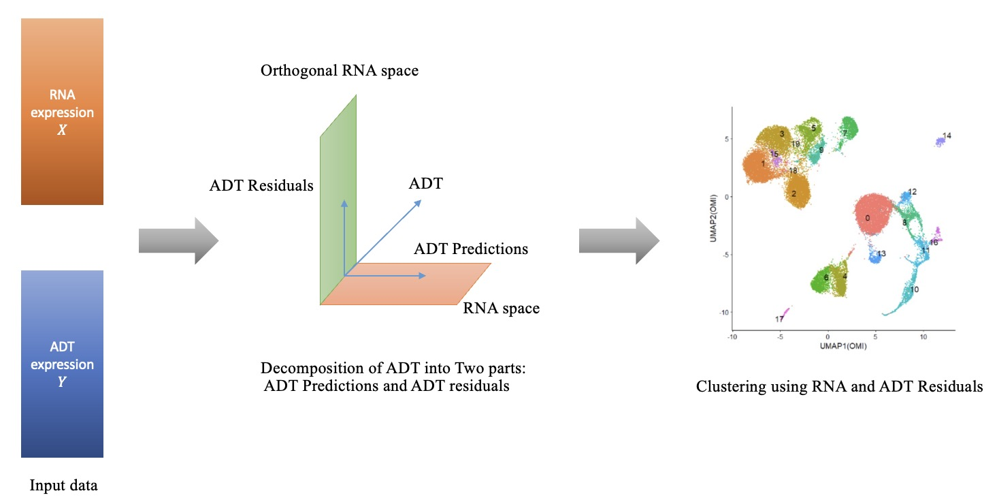

# Orthogonal Multimodality Integration and Clustering (OMIC)

## 1. Introduction 
OMIC is a method that apply projection method to integrate multiple sources of information while accounting for the dependence among them.
It excels at modeling the relationships among multiple variables, facilitating scalable computation,
and preserving accuracy in cell clustering compared to existing methods 

## 2. Environment 
R version 4.0 or greater is required 
### Required packages: 
The detailed requirements can be found [here](https://github.com/lyfhei/OMIC/blob/main/requirements).

## 3.Tutorial 
The [tutorial](https://github.com/lyfhei/OMIC/blob/main/Tutorial.md) provides a instruction of how to implement
OMIC on an actual dataset, including the description for every step. 

## 4. Data used in the paper 
The CBMC data used in the paper can be found [here](https://www.ncbi.nlm.nih.gov/geo/query/acc.cgi?acc=GSE100866).     
The HBMC data used in the paper can be found [here](https://www.ncbi.nlm.nih.gov/geo/query/acc.cgi?acc=GSE128639).      
